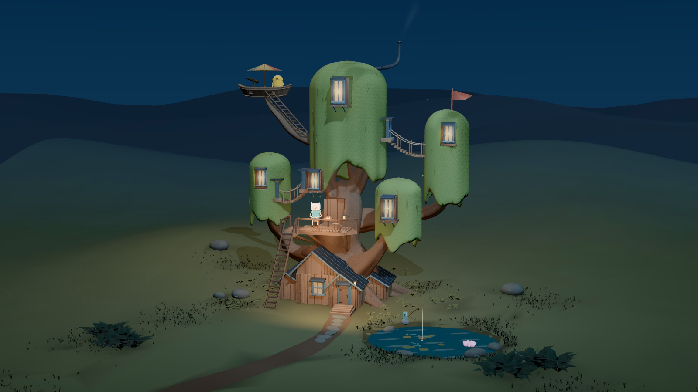

# Adventure Time Treehouse

An interactive miniature of the Land of Ooo, built by Joseph Guerrero with Three.js, TypeScript, Blender, and GSAP. Visit Finn on the porch, Jake in his boat lookout, and BMO by the pond as daylight gives way to a quiet evening.



## Explore

- Orbit the treehouse, zoom into its details, or visit each character through Explore.
- Cycle through day, golden hour, twilight, and deep night with the time icon.
- Discover character interactions and a hidden snail.
- Enable optional background music with the music icon. Audio starts only after a click.
- Reduced-motion preferences are respected.

## Run locally

Use Node.js 24 LTS and npm.

```sh
npm ci
npm run dev
```

Open the local URL printed by Vite. Drag to orbit and scroll or pinch to zoom. Explore provides destinations; Back to clearing restores the overview.

## Checks and production build

```sh
npm test
npm run validate:asset
npm run build
npm run preview
```

The build writes the static site to `dist/`. The asset validator writes its report to `renders/`. The model downloads are several megabytes, so allow time for the initial load. The production build currently reports a large JavaScript chunk; further loading and bundle optimization remains possible.

## Deploy to Vercel

Import this repository into the intended Vercel team. For the current handoff, select **Hype Kidz**. The person importing must have permission to create projects in that team and access to this GitHub repository.

| Setting | Value |
| --- | --- |
| Framework | Vite |
| Root directory | Repository root |
| Install command | `npm ci` |
| Build command | `npm run build` |
| Output directory | `dist` |
| Node.js | 24.x |
| Environment variables | None required |

`vercel.json` includes the framework and build settings. No public deployment URL is claimed yet; add it to the repository About section once the first deployment is verified.

## Project layout

- `src/` — scene loading, lighting, camera, interactions, motion, audio, and interface.
- `public/models/` — production GLB assets, including runtime and collision variants.
- `public/audio/` — optional background music.
- `art/treehouse-master.blend` — main treehouse Blender source.
- `blender/quiet-cameos.blend` — character Blender source.
- `tests/` — behavior and character asset checks.
- `scripts/validate-glb.mjs` — glTF validation.

Historical modeling iterations, local audit screenshots, and rendered demo videos are excluded from this repository. The included Blender files are editable sources; the exported assets in `public/models/` are what the website loads.

## Credits and rights

This is an unofficial Adventure Time fan-art project. Adventure Time and its characters belong to their respective rights holders. No affiliation or endorsement is implied.

Music: **Easy Lemon (60 second)** by Kevin MacLeod ([incompetech.com](https://incompetech.com/music/royalty-free/index.html?isrc=USUAN1200077)), licensed under [Creative Commons Attribution 4.0](https://creativecommons.org/licenses/by/4.0/). Playback volume is reduced and the track repeats while enabled. Credits are also available at `/credits.html` in the app.

No blanket license is granted for the project or third-party character rights. The music retains its own license.
